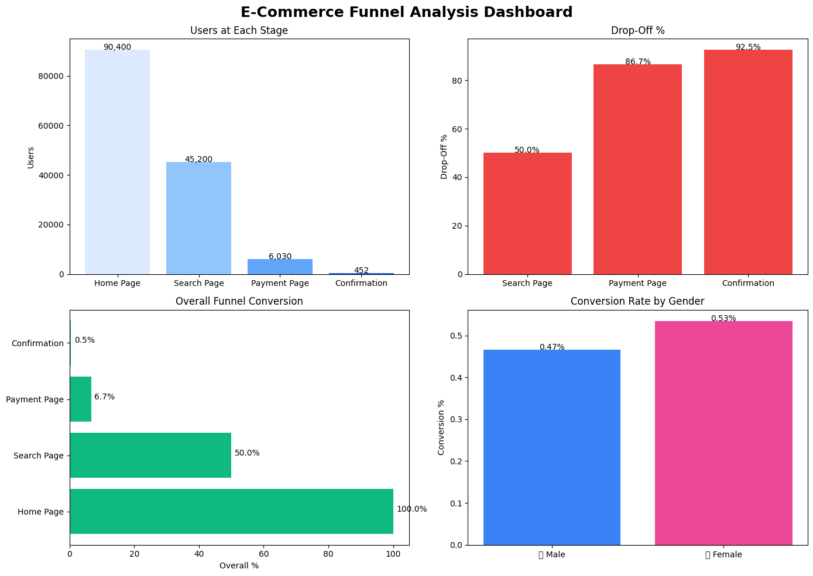

# E-Commerce Funnel Analysis

## Project Overview
This project analyzes user behavior through an e-commerce conversion funnel using Python, Pandas, and data visualization libraries. The goal is to identify where users drop off during the purchasing journey and uncover insights that can improve overall conversion rates.

The funnel stages analyzed are:

- Home Page
- Search Page
- Payment Page
- Confirmation Page

---

## Objectives

- Analyze user movement through the funnel
- Calculate conversion and drop-off rates
- Identify the biggest bottleneck in the customer journey
- Compare conversion performance by gender
- Generate business insights and recommendations

---

## Tools & Libraries Used

- Python
- Pandas
- Matplotlib
- Seaborn

---

## Key KPIs

| Metric | Value |
|---|---|
| Total Visitors | 90,400 |
| Total Purchases | 452 |
| Overall Conversion Rate | 0.5% |
| Users Lost in Funnel | 89,948 |
| Biggest Drop-Off Stage | Confirmation |
| Male Conversion Rate | 0.47% |
| Female Conversion Rate | 0.53% |

---

# Dashboard Preview

## Key Findings

### 1. Overall Conversion Rate
Only 0.5% of users who visited the Home Page completed a purchase. This indicates that a large portion of users dropped before reaching the final confirmation stage.

### 2. Biggest Drop-Off Stage
The largest drop-off occurred between the Payment Page and Confirmation stage. Only 7.5% of users who reached the payment page successfully completed the purchase.

### 3. Gender Insight
Female users had a slightly higher conversion rate (0.53%) compared to male users (0.47%).

### 4. Funnel Health
A total of 89,948 users were lost throughout the funnel journey. Recovering even a small percentage of these users could significantly improve conversions and revenue.

---

## Business Recommendations

- Optimize the payment and confirmation process
- Reduce checkout friction and simplify forms
- Improve search and navigation experience
- Offer multiple payment methods
- Create targeted campaigns for lower-converting user segments

---

## Visualizations Included

- Funnel Stage User Distribution
- Drop-Off Analysis
- Overall Conversion Funnel
- Gender-Based Funnel Analysis
- Conversion Rate by Gender

---

## Conclusion

The analysis reveals significant user drop-offs across the funnel, especially during the final purchase stage. Improving checkout experience and reducing user friction can help increase overall conversion rates and improve customer retention.

---

## Author

Dhanesh N  
Data Science Student
